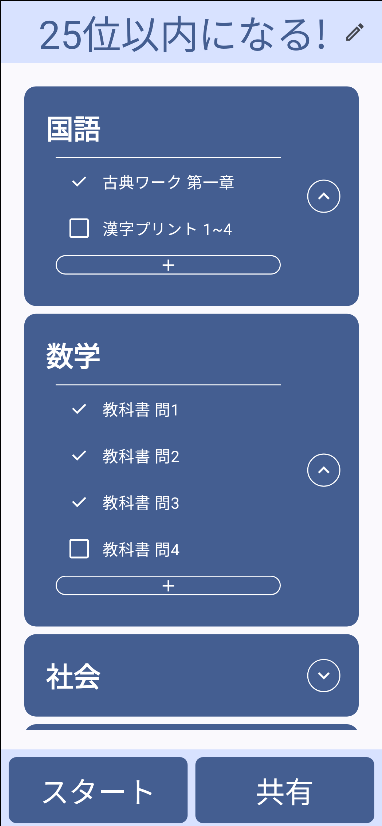

# StudyApp
起業家教育プログラム  

## スクリーンショット

## 参考にした記事
#### slot  
https://qiita.com/maxfie1d/items/6d6ae80338e03bd1dad1  
#### scaffold  
https://medium.com/jetpack-composers/what-does-the-paddingvalues-parameter-in-a-compose-scaffold-do-3bd5592b9c6b  
#### Navigation  
https://developer.android.com/codelabs/basic-android-kotlin-compose-navigation?hl=ja  
https://zenn.dev/slowhand/articles/d1296e56ba2ae1  
